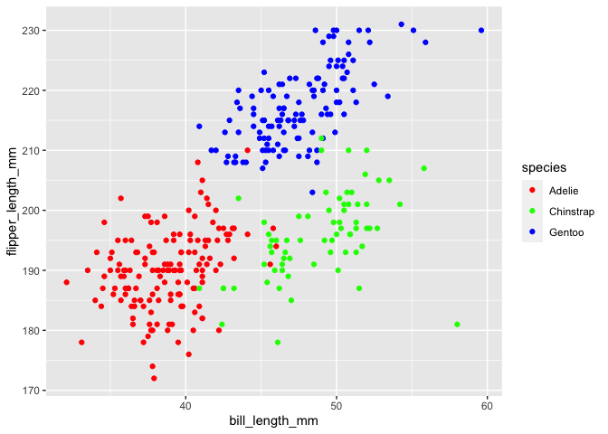

Homework 1
================
Allison Stewart

This is my solution for HW1.

``` r
library(tidyverse)
```

    ## ── Attaching packages ────────────────────────────────────────────────────────── tidyverse 1.3.0 ──

    ## ✓ ggplot2 3.3.2     ✓ purrr   0.3.4
    ## ✓ tibble  3.0.3     ✓ dplyr   1.0.2
    ## ✓ tidyr   1.1.2     ✓ stringr 1.4.0
    ## ✓ readr   1.3.1     ✓ forcats 0.5.0

    ## ── Conflicts ───────────────────────────────────────────────────────────── tidyverse_conflicts() ──
    ## x dplyr::filter() masks stats::filter()
    ## x dplyr::lag()    masks stats::lag()

## Problem 1

Create a data frame with the specified elements.

``` r
prob1_df = 
  tibble(
    samp = rnorm(10), 
    samp_gt_0 = samp > 0, 
    char_vec = c("a", "b", "c", "d", "e", "f", "g", "h", "i", "j"), 
    factor_vec = factor(c("low", "low", "low", "mod", "mod", "mod", "mod", "high", "high", "high"))
  )
```

Take the mean of each variable in my data frame.

``` r
mean(pull(prob1_df, samp))
```

    ## [1] -0.2410732

``` r
mean(pull(prob1_df, samp_gt_0))
```

    ## [1] 0.5

``` r
mean(pull(prob1_df, char_vec))
```

    ## Warning in mean.default(pull(prob1_df, char_vec)): argument is not numeric or
    ## logical: returning NA

    ## [1] NA

``` r
mean(pull(prob1_df, factor_vec))
```

    ## Warning in mean.default(pull(prob1_df, factor_vec)): argument is not numeric or
    ## logical: returning NA

    ## [1] NA

I can take the mean of numbers and logical but not character or factor.

``` r
as.numeric(pull(prob1_df, samp))
```

    ##  [1]  0.60726839  0.58629918 -1.86264465  0.32234647  0.54166951 -1.50458811
    ##  [7] -0.06138036  0.35328054 -0.36162928 -1.03135343

``` r
as.numeric(pull(prob1_df, samp_gt_0))
```

    ##  [1] 1 1 0 1 1 0 0 1 0 0

``` r
as.numeric(pull(prob1_df, char_vec))
```

    ## Warning: NAs introduced by coercion

    ##  [1] NA NA NA NA NA NA NA NA NA NA

``` r
as.numeric(pull(prob1_df, factor_vec))
```

    ##  [1] 2 2 2 3 3 3 3 1 1 1

``` r
as.numeric(pull(prob1_df, samp_gt_0)) * (pull(prob1_df, samp))
```

    ##  [1] 0.6072684 0.5862992 0.0000000 0.3223465 0.5416695 0.0000000 0.0000000
    ##  [8] 0.3532805 0.0000000 0.0000000

``` r
as.factor(pull(prob1_df, samp_gt_0)) * (pull(prob1_df, samp))
```

    ## Warning in Ops.factor(as.factor(pull(prob1_df, samp_gt_0)), (pull(prob1_df, :
    ## '*' not meaningful for factors

    ##  [1] NA NA NA NA NA NA NA NA NA NA

## Problem 2

``` r
data("penguins", package = "palmerpenguins")
```

**Description of Penguins dataset**

This dataset includes the variables: species, island, bill\_length\_mm,
bill\_depth\_mm, flipper\_length\_mm, body\_mass\_g, sex, year.

The size of the dataset is 344 rows by 8 columns.

The mean flipper length is 200.9152047.

Make a scatterplot of flipper length vs bill length.

``` r
ggplot(data=penguins, aes (x = bill_length_mm, y = flipper_length_mm)) + geom_point(aes(color = species)) + scale_color_manual(values = c("red", "green", "blue"))
```

    ## Warning: Removed 2 rows containing missing values (geom_point).

<!-- -->

``` r
ggsave("penguins.jpeg")
```

    ## Saving 7 x 5 in image

    ## Warning: Removed 2 rows containing missing values (geom_point).

This scatterplot plots flipper length vs bill length and distinguishes
the species by color.
